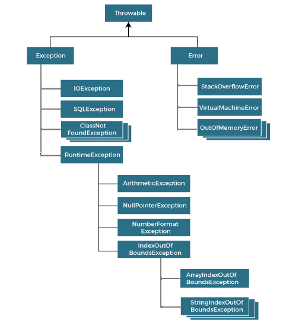

# Exception Handling in Java
The **Exception Handling** in Java is one of the powerful mechanism to handle the runtime errors so that the normal flow of the application can be maintained.
### What is Exception in Java?
In Java, an exception is an event that disrupts the normal flow of the program. It is an object which is thrown at runtime.
### What is Exception Handling?
Exception Handling is a mechanism to handle runtime errors such as ClassNotFoundException, IOException, SQLException, RemoteException, etc.
### Advantage of Exception Handling
The core advantage of exception handling is **to maintain the normal flow of the application.** An exception normally disrupts the normal flow of the application; that is why we need to handle exceptions. Let's consider a scenario:
Suppose there are 10 statements in a Java program and an exception occurs at statement 5; the rest of the code will not be executed, i.e., statements 6 to 10 will not be executed. However, when we perform exception handling, the rest of the statements will be executed. That is why we use exception handling in Java.
## Hierarchy of Java Exception classes
The java.lang.Throwable class is the root class of Java Exception hierarchy inherited by two subclasses: Exception and Error. The hierarchy of Java Exception classes is given below:


## Types of Java Exceptions
There are mainly two types of exceptions: checked and unchecked. An error is considered as the unchecked exception. However, according to Oracle, there are three types of exceptions namely:

- Checked Exception
- Unchecked Exception
- Error

## Difference between Checked and Unchecked Exceptions
1. Checked Exception:
   The classes that directly inherit the Throwable class except RuntimeException and Error are known as checked exceptions. For example, IOException, SQLException, etc. Checked exceptions are checked at compile-time.
2. Unchecked Exception:
   The classes that inherit the RuntimeException are known as unchecked exceptions. For example, ArithmeticException, NullPointerException, ArrayIndexOutOfBoundsException, etc. Unchecked exceptions are not checked at compile-time, but they are checked at runtime.
3.  Error:
    Error is irrecoverable. Some example of errors are OutOfMemoryError, VirtualMachineError, AssertionError etc.

## Java Exception Keywords
Java provides five keywords that are used to handle the exception. The following table describes each.

| Keyword | Description    |
|---------|----------------|
| try     |The "try" keyword is used to specify a block where we should place an exception code. It means we can't use try block alone. The try block must be followed by either catch or finally.|
| catch   |The "catch" block is used to handle the exception. It must be preceded by try block which means we can't use catch block alone. It can be followed by finally block later.|
| finally |The "finally" block is used to execute the necessary code of the program. It is executed whether an exception is handled or not.|
| throw   |The "throw" keyword is used to throw an exception.|
| throws  |The "throws" keyword is used to declare exceptions. It specifies that there may occur an exception in the method. It doesn't throw an exception. It is always used with method signature.|

## Java Exception Handling Example
Let's see an example of Java Exception Handling in which we are using a try-catch statement to handle the exception.
```java
public class JavaExceptionExample{  
  public static void main(String args[]){  
   try{  
      //code that may raise exception  
      int data=100/0;  
   }catch(ArithmeticException e){System.out.println(e);}  
   //rest code of the program   
   System.out.println("rest of the code...");  
  }  
}  
```
Output will be:
```output
Exception in thread main java.lang.ArithmeticException:/ by zero
rest of the code...
```
In the above example, 100/0 raises an ArithmeticException which is handled by a try-catch block.


## Common Scenarios of Java Exceptions
There are given some scenarios where unchecked exceptions may occur. They are as follows:

1. **A scenario where ArithmeticException occurs:**

   If we divide any number by zero, there occurs an ArithmeticException.
```java
int a=50/0;//ArithmeticException   
```
2. **A scenario where NullPointerException occurs:**

   If we have a null value in any variable, performing any operation on the variable throws a NullPointerException.
```java
String s=null;
System.out.println(s.length());//NullPointerException   
```
3. **A scenario where NumberFormatException occurs:**

   If the formatting of any variable or number is mismatched, it may result into NumberFormatException. Suppose we have a string variable that has characters; converting this variable into digit will cause NumberFormatException.
```java
String s="abc";
int i=Integer.parseInt(s);//NumberFormatException  
```
4.  **A scenario where ArrayIndexOutOfBoundsException occurs:**

    When an array exceeds to it's size, the ArrayIndexOutOfBoundsException occurs. there may be other reasons to occur ArrayIndexOutOfBoundsException. Consider the following statements.
```java
int a[]=new int[5];
a[10]=50; //ArrayIndexOutOfBoundsException   
```

