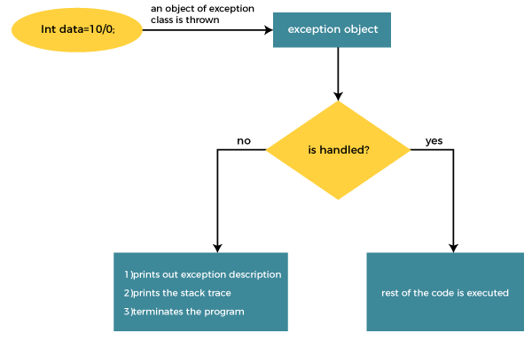

# Java try-catch block
## Java try block
Java **try** block is used to enclose the code that might throw an exception. It must be used within the method.

If an exception occurs at the particular statement in the try block, the rest of the block code will not execute. So, `it is recommended not to keep the code in try block that will not throw an exception`.

Java try block must be followed by either catch or finally block.

Syntax of Java try-catch
```java
try{    
//code that may throw an exception    
}catch(Exception_class_Name ref){}   
```
Syntax of try-finally block
```java

try{    
//code that may throw an exception    
}finally{}    
```
## Java catch block
Java catch block is used to handle the Exception by declaring the type of exception within the parameter. The declared exception must be the parent class exception ( i.e., Exception) or the generated exception type. However, the good approach is to declare the generated type of exception.

The catch block must be used after the try block only. You can use multiple catch block with a single try block.

## Internal Working of Java try-catch block

The JVM firstly checks whether the exception is handled or not. If exception is not handled, JVM provides a default exception handler that performs the following tasks:
- Prints out exception description.
- Prints the stack trace (Hierarchy of methods where the exception occurred).
- Causes the program to terminate.

But if the application programmer handles the exception, the normal flow of the application is maintained, i.e., rest of the code is executed.
## Problem without exception handling
Let's try to understand the problem if we don't use a try-catch block.

### Example 1
```java
public class Example1 {
    public static void main(String[] args) {
        int data=50/0;
        System.out.println("last Line");
    }
}
```
As nothing can be divided by zero so it will gave a exception and it will break the code so it will not print "The last line"

this is a ArithmeticException and  Hierarchy of ArithmeticException are below below:

`Throwable → Exception → RuntimeException → ArithmeticException`


Output:

```output
Exception in thread "main" java.lang.ArithmeticException: / by zero
```
There might be 100 lines of code after the exception. If the exception is not handled, all the code below the exception won't be executed.

#### Solution by exception handling
Let's see the solution of the above problem by a java try-catch block.

### Example 2
```java

public class Example2 {
    public static void main(String[] args) {
        System.out.println("First Line");
        try {
            int data= 50/0;
            System.out.println("I am in Try block");
        }catch (ArithmeticException e){
            System.out.println("I am in Catch Block ");
            System.out.println(e);
        }
        System.out.println("The last line");
    }
} 
```
Output:
```output
First Line
I am in Catch Block
java.lang.ArithmeticException: / by zero
The last line
```
Here, By adding try catch block now i was able to handle the error and print "The last line" .

### Example 3
In this example, we also kept the code in a try block that will not throw an exception.
```java
public class TryCatchExample3 {  
  
    public static void main(String[] args) {  
        try  
        {  
        int data=50/0; //may throw exception   
                         // if exception occurs, the remaining statement will not exceute  
        System.out.println("rest of the code");  
        }  
             // handling the exception   
        catch(ArithmeticException e)  
        {  
            System.out.println(e);  
        }  
          
    }  
      
}  
```
Output:
```output
java.lang.ArithmeticException: / by zero
```
Here, we can see that if an exception occurs in the try block, the rest of the block code will not execute.

###  Example 4
Here, we handle the exception using the parent class exception.
we again do the same code again and in here we will call our exception different way
as our Exception for (50/0) is ArithmeticException so its Hierarchy

`Throwable → Exception → RuntimeException → ArithmeticException`
```java
public class Example3 {
    
    public static void main(String[] args) {
        try{
            int data1= 10/0;
        }catch (Throwable e){
            System.out.println("Throwable: " +e.getMessage());
            //e show the exception and message
            //e.getmessage() only provide the message
        }
        try{
            int data2= 10/0;
        }catch (Exception e){
            System.out.println("Exception: " +e.getMessage());
        }
        try{
            int data3= 10/0;
        }catch (RuntimeException e){
            System.out.println("RuntimeException: " +e.getMessage());
        }
        try{
            int data4= 10/0;
        }catch (ArithmeticException e){
            System.out.println("ArithmeticException: " +e.getMessage());
        }
        System.out.println("The last line");

    }
}
```
Output:
```output
Throwable: / by zero
Exception: / by zero
RuntimeException: / by zero
ArithmeticException: / by zero
The last line
```
Here we can understand we can call exception by its parent class it will work same.

### Example 5
Let's see an example to print a custom message on exception.
```java
public class TryCatchExample5 {  
  
    public static void main(String[] args) {  
        try  
        {  
        int data=50/0; //may throw exception   
        }  
             // handling the exception  
        catch(Exception e)  
        {  
                  // displaying the custom message  
            System.out.println("Can't divided by zero");  
        }  
    }  
      
}  
```
Output:
```output
Can't divided by zero
```
### Example 6
Let's see an example to resolve the exception in a catch block.
```java
public class TryCatchExample6 {  
  
    public static void main(String[] args) {  
        int i=50;  
        int j=0;  
        int data;  
        try  
        {  
        data=i/j; //may throw exception   
        }  
            // handling the exception  
        catch(Exception e)  
        {  
             // resolving the exception in catch block  
            System.out.println(i/(j+2));  
        }  
    }  
} 
```
Output:
```output
25
```
### Example 7
In this example, along with try block, we also enclose exception code in a catch block.
```java
public class TryCatchExample7 {  
  
    public static void main(String[] args) {  
          
        try  
        {  
        int data1=50/0; //may throw exception   
  
        }  
             // handling the exception  
        catch(Exception e)  
        {  
            // generating the exception in catch block  
        int data2=50/0; //may throw exception   
  
        }  
    System.out.println("rest of the code");  
    }  
}
```
Output:
```output
Exception in thread "main" java.lang.ArithmeticException: / by zero
```
Here, we can see that the catch block didn't contain the exception code. So, enclose exception code within a try block and use catch block only to handle the exceptions.

### Example 8
In this example, we handle the generated exception (Arithmetic Exception) with a different type of exception class (ArrayIndexOutOfBoundsException).

```java
public class TryCatchExample8 {  
  
    public static void main(String[] args) {  
        try  
        {  
        int data=50/0; //may throw exception   
  
        }  
            // try to handle the ArithmeticException using ArrayIndexOutOfBoundsException  
        catch(ArrayIndexOutOfBoundsException e)  
        {  
            System.out.println(e);  
        }  
        System.out.println("rest of the code");  
    }  
      
}  
```
Output:

```output
Exception in thread "main" java.lang.ArithmeticException: / by zero
```
### Example 9
Let's see an example to handle another unchecked exception.

```java
public class TryCatchExample9 {  
  
    public static void main(String[] args) {  
        try  
        {  
        int arr[]= {1,3,5,7};  
        System.out.println(arr[10]); //may throw exception   
        }  
            // handling the array exception  
        catch(ArrayIndexOutOfBoundsException e)  
        {  
            System.out.println(e);  
        }  
        System.out.println("rest of the code");  
    }  
      
} 
```
Output:
```output
java.lang.ArrayIndexOutOfBoundsException: 10
rest of the code
```
### Example 10
Let's see an example to handle checked exception.
```java
import java.io.FileNotFoundException;  
import java.io.PrintWriter;  
  
public class TryCatchExample10 {  
  
    public static void main(String[] args) {  
          
          
        PrintWriter pw;  
        try {  
            pw = new PrintWriter("jtp.txt"); //may throw exception   
            pw.println("saved");  
        }  
// providing the checked exception handler  
 catch (FileNotFoundException e) {  
              
            System.out.println(e);  
        }         
    System.out.println("File saved successfully");  
    }  
}  
```
Output:
```output
File saved successfully
```
